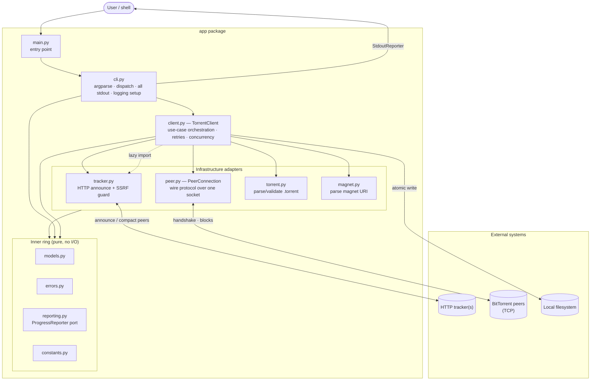
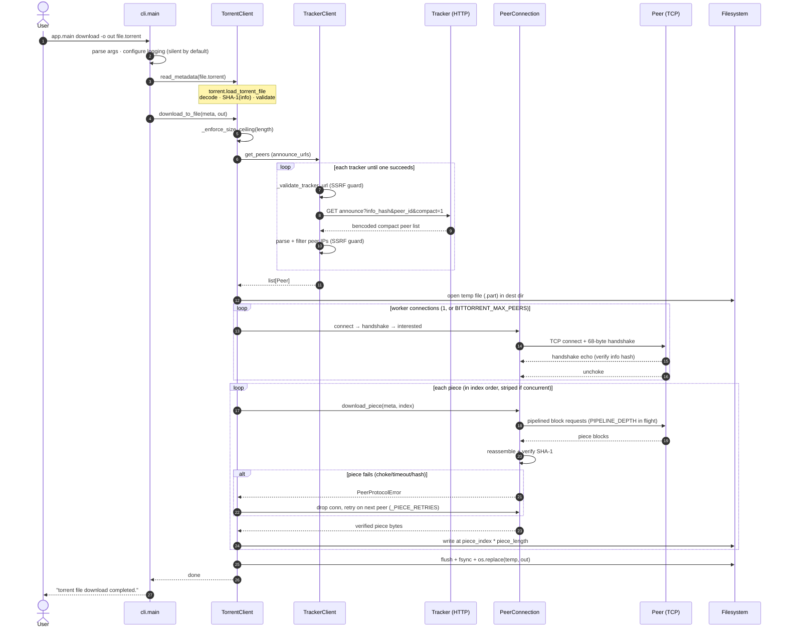

# BitTorrent Client

A security-hardened BitTorrent client in Python, built on a layered
(ports-and-adapters) architecture. It implements the core BitTorrent protocol —
tracker announce, the peer wire handshake, pipelined piece download with SHA-1
verification — and magnet links via the BEP 9 metadata extension, all behind a
single `python3 -m app.main` command-line interface.

<p>
  
  
  
  
</p>

> Built as a [CodeCrafters](https://codecrafters.io/challenges/bittorrent) "Build your own BitTorrent"
> track, then hardened well past the grading surface: an SSRF guard on everything
> a tracker or peer can influence, size ceilings on every untrusted length, atomic
> file output, structured logging, multi-tracker and per-piece failover, and
> optional multi-peer concurrency.

---

## Table of contents

- [Project Overview](#project-overview)
- [Features](#features)
- [System Architecture](#system-architecture)
- [Project Structure](#project-structure)
- [Requirements](#requirements)
- [Installation](#installation)
- [Quick start](#quick-start)
- [Usage](#usage)
- [Configuration](#configuration)
- [Security model](#security-model)
- [Development](#development)
- [Testing](#testing)
- [Troubleshooting](#troubleshooting)
- [Acknowledgements](#acknowledgements)

---

## Project Overview

This client turns a `.torrent` file or a magnet URI into bytes on disk. It
announces to one or more HTTP trackers to discover peers, opens the BitTorrent
wire protocol to those peers over TCP, downloads each piece as a pipelined stream
of 16 KiB blocks, verifies every piece against its SHA-1 digest, and writes the
result atomically.

It began as a [CodeCrafters](https://codecrafters.io/challenges/bittorrent) "Build your own BitTorrent"
implementation and was then hardened well beyond the grading surface. Three goals
drive the design:

1. **Correctness as a contract.** The observable output (stdout/stderr, exit
   codes, produced files) is asserted byte-for-byte by an end-to-end test suite,
   so behaviour is pinned, not incidental.
2. **Safety against hostile input.** Everything from a torrent, magnet, tracker,
   or peer is untrusted; an SSRF guard, size ceilings, and integrity checks bound
   every input.
3. **Operability.** Structured, opt-in logging and a `selftest` command make the
   client debuggable in the field without ever polluting its default output.

The codebase is deliberately small and strictly layered: each concern is one
module under `app/`, and dependencies point inward toward pure, I/O-free entities.

---

## Features

- **Torrent files and magnet links** — read `.torrent` metadata or fetch it from a
  peer over the BEP 9 / BEP 10 metadata extension.
- **Full download pipeline** — tracker announce → peer handshake → pipelined block
  requests (16 KiB blocks, a sliding window of in-flight requests) → per-piece
  SHA-1 verification → atomic write to disk.
- **Resilience** — multi-tracker failover (BEP 12 `announce-list`), per-piece
  failover to another peer on choke/timeout/reset/hash-mismatch, and bounded
  exponential-backoff retry on connect.
- **Optional concurrency** — stripe pieces across N peer connections
  (`BITTORRENT_MAX_PEERS`) while keeping output byte-for-byte identical to the
  sequential path.
- **Security-first** — an SSRF guard on the tracker URL *and* on tracker-supplied
  peer addresses, manual redirect re-validation, size ceilings on every untrusted
  length, and integrity verification of both metadata and every piece.
- **Observability** — opt-in structured logging (terse `key=value` text or JSON
  lines), per-record sampling, redaction, a per-run id, and an optional rotating
  log file — all silent by default.
- **Atomic, crash-safe output** — downloads land at their final path only on
  success, never half-written.
- **Supply-chain hygiene** — fully pinned, hashed dependencies (pip-tools) and a
  `pip-audit` workflow.
---

## System Architecture

A layered, ports-and-adapters design. Dependencies point **inward**; the inner
ring (`models`, `errors`, `reporting`, `constants`) performs no I/O.

| Module | Responsibility |
| --- | --- |
| `app/main.py` | thin entry point (`python3 -m app.main`) |
| `app/cli.py` | argument parsing, dispatch, **all** stdout presentation, logging setup |
| `app/client.py` | `TorrentClient` — use-case orchestration, connection lifecycle, retries, concurrency |
| `app/tracker.py` | HTTP tracker client (SSRF-guarded announce + compact peer list) |
| `app/peer.py` | `PeerConnection` — the peer wire protocol over one socket |
| `app/torrent.py` | build `TorrentMetadata` from a file or a raw `info` dict |
| `app/magnet.py` | magnet URI parsing |
| `app/models.py` | immutable domain entities (`Peer`, `MagnetLink`, `TorrentMetadata`) |
| `app/errors.py` | the `BitTorrentError` hierarchy (the error contract) |
| `app/reporting.py` | the `ProgressReporter` port + sinks |
| `app/constants.py` | protocol constants and tunables |

Two cross-cutting rules shape the design:

1. **Byte-exact stdout/stderr is a contract**.
   All presentation lives in `app/cli.py`; the logger is silent by default.
2. **Everything external is untrusted** — see the [security model](#security-model).

### High-level system architecture

Outer layers depend on inner ones, never the reverse.



**Key edges**

- `cli` is the only layer that touches `argv` or writes presentation to stdout.
- `client` orchestrates the adapters and owns the connection lifecycle.
- The `client → tracker` edge is **lazy** (imported on first announce) so cold
  start stays fast and `requests`/`urllib3` load only when needed.
- Output is inverted: inner layers report through the `ProgressReporter` port; the
  CLI injects the concrete `StdoutReporter`.

### Request lifecycle — a full `download`



The magnet flows differ only at the start: peers come from the magnet's trackers,
the handshake sets the extension bit, and `TorrentMetadata` is fetched from a peer
(BEP 9) and verified against the magnet's info hash before the same piece loop
runs.

---

## Project Structure

```
.
├── app/                      # the client — one module per layer
│   ├── main.py               # entry point (python3 -m app.main)
│   ├── cli.py                # argparse, dispatch, all stdout, logging setup
│   ├── client.py             # TorrentClient: orchestration, retries, concurrency
│   ├── tracker.py            # HTTP tracker client (SSRF-guarded)
│   ├── peer.py               # PeerConnection: the peer wire protocol
│   ├── torrent.py            # build TorrentMetadata from a file / raw info dict
│   ├── magnet.py             # magnet URI parsing
│   ├── models.py             # immutable entities: Peer, MagnetLink, TorrentMetadata
│   ├── errors.py             # the BitTorrentError hierarchy (error contract)
│   ├── reporting.py          # ProgressReporter port + sinks
│   ├── constants.py          # protocol constants and tunables
│   └── __init__.py           # __version__ + library NullHandler
├── tests/
│   ├── unit/ integration/ e2e/
│   └── conftest.py           # shared fakes: FakePeer, TrackerStub, make_torrent
├── requirements.in           # direct dependency pins (pip-tools source)
├── requirements.txt          # compiled, fully-pinned, hashed lockfile
└── requirements-dev.txt      # dev tooling (pip-tools, pip-audit, mypy)
```

| Layer | Module(s) | Role |
| --- | --- | --- |
| Entry / interface | `main`, `cli` | parse args, dispatch, render all output |
| Application | `client` | orchestrate use cases, lifecycle, concurrency |
| Infrastructure | `tracker`, `peer`, `torrent`, `magnet` | talk to trackers/peers/files |
| Domain (pure) | `models`, `errors`, `reporting`, `constants` | entities, contracts, tunables |

---

## Requirements

- **Python 3.8+** (the `selftest` command enforces this floor; developed and
  tested on CPython 3.10+).
- Runtime dependencies, installed from the pinned, hashed lockfile:

| Dependency | Pinned | Role |
| --- | --- | --- |
| [`bencode.py`](https://pypi.org/project/bencode.py/) | `4.0.0` | bencode encode/decode |
| [`requests`](https://pypi.org/project/requests/) | `2.34.2` | HTTP tracker client |
| [`urllib3`](https://pypi.org/project/urllib3/) | `2.7.0` | transport, retry/redirect control |
| [`pytest`](https://pypi.org/project/pytest/) | `9.1.1` | test runner (dev) |

Dependencies are managed with **pip-tools**: direct pins live in `requirements.in`
and are compiled to the fully-pinned, hashed `requirements.txt`.

---

## Installation

```bash
# 1. Clone
git clone https://github.com/sibomana-si/BitTorrent-Client
cd BitTorrent-Client

# 2. (Recommended) create a virtual environment
python3 -m venv .venv
source .venv/bin/activate          # Windows: .venv\Scripts\activate

# 3. Install pinned, hash-verified runtime dependencies
pip install -r requirements.txt

# 4. (Optional) developer tooling: pip-tools, pip-audit, mypy
pip install -r requirements-dev.txt
```

`requirements.txt` is generated with `--generate-hashes`, so installation is
hash-verified end to end. Verify the install:

```bash
python3 -m app.main selftest
```

---

## Quick start

```bash
# Inspect a .torrent
python3 -m app.main info sample.torrent

# Ask the tracker for peers
python3 -m app.main peers sample.torrent

# Download a whole torrent to a file
python3 -m app.main download -o ./downloaded.bin sample.torrent

# Same, from a magnet link
python3 -m app.main magnet_download -o ./downloaded.bin "magnet:?xt=urn:btih:..."
```

By default the client is **silent on stderr** and prints only the command's
result to stdout. Add `-v` (INFO) or `-vv` (DEBUG) for diagnostics.

---

## Usage

All commands are subcommands of `python3 -m app.main`. The global logging flags
(below) may appear **before or after** the subcommand name.

### Torrent-file commands

| Command | Arguments | Output |
| --- | --- | --- |
| `decode` | `<bencoded-value>` | the value as JSON |
| `info` | `<file.torrent>` | tracker URL, length, info hash, piece length, piece hashes |
| `peers` | `<file.torrent>` | one `ip:port` per line |
| `handshake` | `<file.torrent> [ip:port]` | `Peer ID: <hex>` |
| `download_piece` | `-o <out> <file.torrent> <index>` | `piece downloaded to <out>` |
| `download` | `-o <out> <file.torrent>` | `torrent file download completed.` |

### Magnet-link commands

| Command | Arguments | Output |
| --- | --- | --- |
| `magnet_parse` | `<magnet-uri>` | tracker URL + info hash |
| `magnet_handshake` | `<magnet-uri>` | peer id + `ut_metadata` extension id |
| `magnet_info` | `<magnet-uri>` | same fields as `info` (metadata fetched from a peer) |
| `magnet_download_piece` | `-o <out> <magnet-uri> <index>` | `magnet piece downloaded to <out>` |
| `magnet_download` | `-o <out> <magnet-uri>` | `torrent magnet file download completed.` |

### Diagnostics

| Command | Arguments | Purpose |
| --- | --- | --- |
| `selftest` | `[source] [--check-tracker]` | build provenance + PASS/FAIL reachability checks; exits non-zero on failure. A `source` (`.torrent`/magnet) adds a DNS check; `--check-tracker` adds a live announce. |

### Examples

```bash
# Decode a bencoded value to JSON
python3 -m app.main decode "d3:foo3:bar5:helloi52ee"
# {"foo": "bar", "hello": 52}

# Download a single piece
python3 -m app.main download_piece -o ./piece-0.bin sample.torrent 0

# Handshake with a specific peer, with DEBUG diagnostics as JSON
python3 -m app.main -vv --log-format json handshake sample.torrent 1.2.3.4:6881

# Magnet download (metadata fetched from a peer first)
python3 -m app.main magnet_download -o ./out.bin "magnet:?xt=urn:btih:..."

# 4 peer connections, DEBUG diagnostics as JSON to a rotating, redacted log file
BITTORRENT_MAX_PEERS=4 python3 -m app.main \
    -vv --log-format json --log-file ./run.jsonl --log-redact \
    download -o ./out.bin sample.torrent

# Verify reachability, including a live announce
python3 -m app.main selftest sample.torrent --check-tracker
```

### Behaviour and exit codes

- **stdout** carries only the command result (byte-exact); **stderr** is silent
  unless a logging flag is given.
- An expected operational failure prints `error: <message>` to stderr and exits
  **1**.
- `Ctrl-C` prints `interrupted` and exits **130**.
- Unexpected bugs propagate as a full traceback (never masked).

### Global logging flags

| Flag | Effect |
| --- | --- |
| `-v`, `-vv` | diagnostics on stderr at INFO / DEBUG |
| `--log-level {DEBUG,INFO,WARNING,ERROR,CRITICAL}` | explicit level (overrides `-v`) |
| `--log-format {text,json}` | terse `key=value` text or JSON lines |
| `--log-redact` | mask peer addresses / ids / info hash in logs |
| `--log-run-id` | stamp a per-invocation run id on every record |
| `--log-file PATH` | also write JSON-lines diagnostics to a rotating file |

---

## Configuration

All configuration is via environment variables (no config files).

| Variable | Default | Description |
| --- | --- | --- |
| `BITTORRENT_MAX_PEERS` | `1` | Concurrent peer connections for a full download. `1`/unset = sequential single-connection path; higher = stripe pieces across that many peers. |
| `BITTORRENT_PEER_ID` | random | Pin the 20-byte peer id (must encode to exactly 20 bytes). Unset = a fresh per-run Azureus-style id (`-CC0100-` + random). |
| `BITTORRENT_ALLOW_PRIVATE_PEERS` | unset | Allow tracker-supplied peers on loopback/private/link-local addresses. Needed for LAN / private-tracker swarms; **leave unset in untrusted contexts.** |
| `BITTORRENT_LOG_LEVEL` | silent | Fallback log level (`DEBUG`…`CRITICAL`) when no `-v`/`--log-level` flag is given. |
| `BITTORRENT_LOG_REDACT` | unset | Mask peer addresses / ids / info hash in logs (same as `--log-redact`). |
| `BITTORRENT_LOG_FILE` | unset | Also write JSON-lines diagnostics to a rotating file (same as `--log-file`). |

---

## Security model

Everything that arrives from a `.torrent` file, a magnet link, a tracker, or a
peer is treated as **untrusted**. The hardening:

- **SSRF guard (two gates).** The tracker URL is restricted to `http`/`https`, its
  host is resolved, and *every* resolved address is rejected if it is loopback,
  private/RFC-1918, link-local (including the cloud-metadata address
  `169.254.169.254`), reserved, multicast, or unspecified. Redirects are followed
  **manually** and re-validated on each hop. Tracker-supplied **peer addresses**
  are held to the same guard (opt out with `BITTORRENT_ALLOW_PRIVATE_PEERS` for a
  legitimate LAN swarm).
- **Size ceilings.** Every untrusted length is capped: torrent length, piece
  length, metadata blob, tracker response body, and per-message size — so a
  crafted input cannot drive a huge allocation or disk-filling write.
- **Integrity.** Magnet metadata is verified against the magnet's info hash before
  use, and every downloaded piece is verified by raw SHA-1 before it is written.
- **Atomic output.** Downloads are written to a temp file, flushed + fsynced, then
  atomically renamed into place, so an interrupt never leaves a partial file at
  the final path.

> ⚠️ This is a personal-use client. Review the security model
> before pointing it at untrusted swarms, and keep `BITTORRENT_ALLOW_PRIVATE_PEERS`
> unset unless you specifically need private addresses.

To scan the pinned dependencies for known CVEs:

```bash
pip-audit -r requirements.txt
```

---

## Development

```bash
pip install -r requirements-dev.txt     # pip-tools, pip-audit, mypy

# Type-check
mypy app

# Audit pinned dependencies for known CVEs
pip-audit -r requirements.txt

# Regenerate the lockfile after editing requirements.in
pip-compile --generate-hashes requirements.in
```

The dependency workflow is: **edit `requirements.in` → recompile to
`requirements.txt`**. Never hand-edit the lockfile.

---

## Testing

The suite has **331 tests** across three layers, with shared protocol fakes in
`tests/conftest.py` (a real local `FakePeer` over loopback TCP, a `TrackerStub`,
and a `make_torrent` factory).

```bash
# Run the full suite (from the repo root)
python3 -m pytest

# One layer
python3 -m pytest tests/unit
python3 -m pytest tests/integration
python3 -m pytest tests/e2e

# One test
python3 -m pytest tests/unit/test_peer.py::TestDownloadPiece::test_name
```

> **Run pytest from the repo root** — tests import `from tests.conftest import ...`,
> so the root must be on `sys.path`.

The e2e tests drive `app.cli.main(argv)` — the exact path `python3 -m app.main`
runs — and assert the full observable contract: byte-exact stdout, stderr, exit
codes, and produced files.

---

## Troubleshooting

| Symptom | Likely cause / fix |
| --- | --- |
| `error: Tracker host '...' resolves to a blocked address` | The tracker (or a redirect) points at an internal/loopback/metadata address — the SSRF guard. Expected for local testing; use a real public tracker. |
| `error: Tracker returned only blocked peer addresses` | Every peer the tracker returned is on a private/loopback address. For a legitimate LAN swarm set `BITTORRENT_ALLOW_PRIVATE_PEERS=1`. |
| `ImportError` / `from tests.conftest` fails | Run pytest from the **repo root**. |
| Hash-mismatch errors during install | Ensure you install from the committed `requirements.txt` (hashed); don't mix in unpinned packages. |
| No diagnostic output | The logger is silent by default — add `-v` / `-vv` or set `BITTORRENT_LOG_LEVEL`. |
| Slow first command | The first announce lazily imports `requests`/`urllib3`. Commands that don't announce (`decode`, `info`, `magnet_parse`) stay fast. |

---

## Acknowledgements

Originally built on the [CodeCrafters](https://codecrafters.io/challenges/bittorrent) "Build your own
BitTorrent" challenge, implementing the relevant BitTorrent Enhancement Proposals
(BEP 3, BEP 9, BEP 10, BEP 12, BEP 23).
